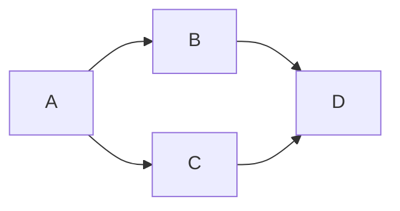

# markdown-examples
Markdown Examples

## Mermaid



## Blockquote Annotations

> **Note**: This is a note

> **Warning**: This is a warning

## Code Reference

https://github.com/AlexHedley/markdown-examples/blob/44cb0a717f6f4e18bda56b3f8f843370fdd6bb24/customer.sql#L1

## Diff

``` diff
diff --git a/filea.extension b/fileb.extension
index d28nd309d..b3nu834uj 111111
--- a/filea.extension
+++ b/fileb.extension
@@ -1,6 +1,6 @@
-oldLine
+newLine
```

```diff
public class Hello1
{
   public static void Main()
   {
-      System.Console.WriteLine("Hello, World!");
+      System.Console.WriteLine("Rock all night long!");
   }
}
```

## Math Support

- [Math support in Markdown](https://github.blog/2022-05-19-math-support-in-markdown/)

When $a \ne 0$, there are two solutions to $(ax^2 + bx + c = 0)$ and they are 
$$ x = {-b \pm \sqrt{b^2-4ac} \over 2a} $$

- https://docs.github.com/en/get-started/writing-on-github/working-with-advanced-formatting/writing-mathematical-expressions

This sentence uses `$` delimiters to show math inline:  $\sqrt{3x-1}+(1+x)^2$

This sentence uses $\` and \`$ delimiters to show math inline:  $`\sqrt{3x-1}+(1+x)^2`$

**The Cauchy-Schwarz Inequality**
$$\left( \sum_{k=1}^n a_k b_k \right)^2 \leq \left( \sum_{k=1}^n a_k^2 \right) \left( \sum_{k=1}^n b_k^2 \right)$$

**The Cauchy-Schwarz Inequality**

```math
\left( \sum_{k=1}^n a_k b_k \right)^2 \leq \left( \sum_{k=1}^n a_k^2 \right) \left( \sum_{k=1}^n b_k^2 \right)
```

This expression uses `\$` to display a dollar sign: $`\sqrt{\$4}`$

To split <span>$</span>100 in half, we calculate $100/2$
