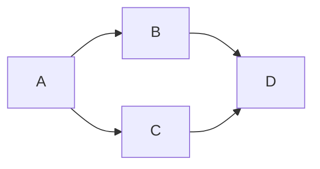

# markdown-examples
Markdown Examples

## Mermaid



## Blockquote Annotations

> **Note**: This is a note

> **Warning**: This is a warning

## Code Reference

https://github.com/AlexHedley/markdown-examples/blob/44cb0a717f6f4e18bda56b3f8f843370fdd6bb24/customer.sql#L1

## Diff

``` diff
diff --git a/filea.extension b/fileb.extension
index d28nd309d..b3nu834uj 111111
--- a/filea.extension
+++ b/fileb.extension
@@ -1,6 +1,6 @@
-oldLine
+newLine
```

```diff
public class Hello1
{
   public static void Main()
   {
-      System.Console.WriteLine("Hello, World!");
+      System.Console.WriteLine("Rock all night long!");
   }
}
```
